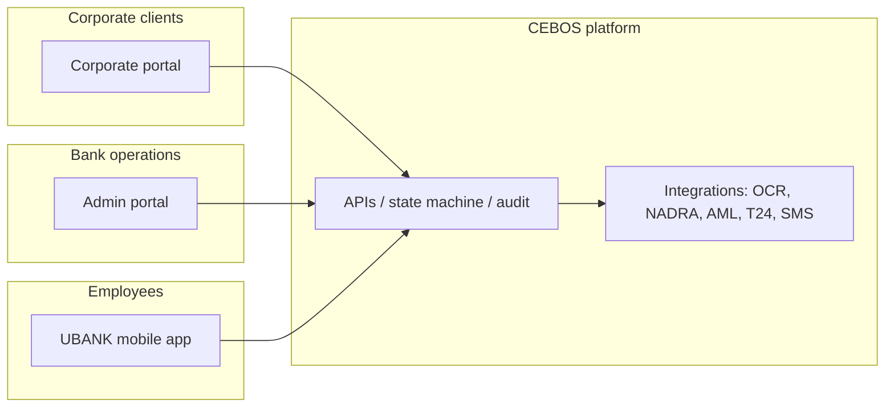
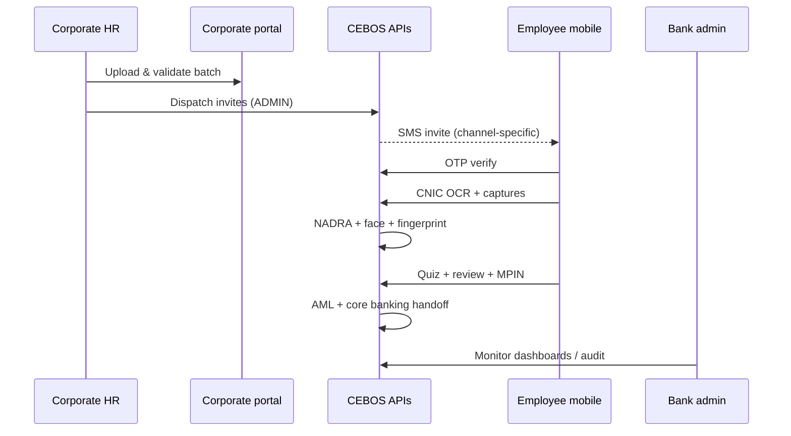

# CEBOS Digital Employee Onboarding Suite

**Product documentation — v1.0**  
**Classification:** Internal / stakeholder  
**Last updated:** 14 May 2026  

> **Repository layout:** This copy lives under `backend/docs/`. Screenshot links resolve to `../../docs/...` (workspace-level `docs/` next to `backend/`). A sibling copy may exist at `docs/PRODUCT_DOCUMENT.md` with paths relative to that folder.

---

## Document control

| Field | Value |
|--------|--------|
| Product suite | **CEBOS** (Corporate Employee Bulk Onboarding System) |
| Customer-facing mobile brand | **UBANK Onboarding** (Android reference build) |
| Primary artefacts | `backend/`, `corporate-portal/`, `admin-portal/`, `android/` |
| Visual evidence | `../../docs/digital_onboarding_*` (screenshots referenced in §7–8) |
| Related technical baselines | `docs/architecture/CEBOS_PHASE1_ARCHITECTURE.md`, `docs/CEBOS_PROJECT_PLAN.md`, `docs/openapi/` |

**Audience:** executive sponsors, product owners, compliance, operations, engineering, and implementation partners.

---

## Executive summary

CEBOS is an **enterprise-grade, multi-tenant digital onboarding platform** that enables **regulated salary-account opening** for employees of corporate clients. The suite spans **three coordinated experiences**:

1. **Corporate portal** — employer-side bulk intake, batch governance, invite orchestration, and operational reporting.  
2. **Bank admin portal** — cross-company supervision, batch health, configuration, and immutable audit trails.  
3. **UBANK mobile onboarding** — employee self-service journey from mobile verification through **KYC capture (CNIC OCR), NADRA checks, biometrics (face + fingerprint), knowledge-based verification, compliance declarations, MPIN**, and **account-opening orchestration** with clear post-submission expectations.

The platform is designed around a **single source of truth for journey state** (`employee_onboarding.status`), **resumable flows**, **API-first integration**, and **auditability** suitable for financial services operating models.

---

## Product identity & scope

### Vision

Deliver a **repeatable, measurable, and auditable** digital channel for corporate payroll onboarding that reduces branch dependency while preserving **KYC/AML rigor** and **core-banking alignment**.

### In scope (Phase-1 product surface)

- Corporate **batch upload & lifecycle** (upload → validate → invite → monitor).  
- Bank **tenant administration** (clients, batches at aggregate level, configuration, audit).  
- Employee **mobile journey** with document capture, biometric checks, quiz/KBA, review, and MPIN.  
- **Status-driven** APIs and portals aligned to onboarding state machine.

### Out of scope (for this document)

- Core ledger posting rules beyond integration hand-off (e.g., T24 product configuration).  
- Non-CEBOS operational tools shown only as collateral in **Appendix C** (e.g., team chat, automation host setup screens).

---

## Stakeholders & personas

| Persona | Goal | Primary surface |
|---------|------|-------------------|
| **Corporate HR / Payroll Ops** | Upload eligible employees, dispatch invites, track batch progress | Corporate portal |
| **Corporate VIEWER** | Read-only monitoring with masked identifiers | Corporate portal |
| **Bank Operations** | Cross-company oversight, batch KPIs, incident triage | Admin portal |
| **Bank SUPER_ADMIN** | Runtime configuration (mobile schema, quizzes, force-update) | Admin portal |
| **Compliance / Audit** | Prove who changed what, when, and why | Admin portal + DB history |
| **Employee (end user)** | Complete onboarding on mobile with minimal friction | UBANK mobile app |

---

## Problem statement & value proposition

### Problems addressed

- **Manual, branch-heavy onboarding** that does not scale with payroll cycles.  
- **Fragmented evidence** across spreadsheets, email, and branch folders.  
- **Weak traceability** for regulatory inquiries (who approved what, which biometric path was used).  
- **Inconsistent employee experience** across employers and regions.

### Value delivered

- **Operational scale** via batch ingestion and automated invite dispatch.  
- **Risk-aware automation** with explicit gates (NADRA, AML, biometrics, review).  
- **Enterprise transparency** through dashboard KPIs and status audit timelines.  
- **Controlled change management** via server-driven mobile configuration (forms, quizzes, minimum versions).

---

## Solution overview

### Logical architecture (conceptual)

### Design principles (non-negotiables)

- **State machine ownership:** only controlled services transition `employee_onboarding.status`.  
- **Gate enforcement:** each advancing API validates allowed statuses (no “skip steps”).  
- **Resumability:** mobile resumes from current status after network loss or app restart.  
- **Separation of duties:** corporate vs bank admin roles with least privilege.  
- **Evidence retention:** captures, OCR payloads, and transition reasons are persisted for audit.

---

## Capability catalogue (with UI evidence)

Screenshots live under:

- `../../docs/digital_onboarding_mobile/`  
- `../../docs/digital_onboarding_client/`  
- `../../docs/digital_onboarding_admin/`

> **Note on filenames:** macOS screenshots may contain a narrow no-break space (`U+202F`) before `PM` in `.png` names. This document uses **percent-encoded** URLs so links render reliably in Git viewers.

---

### 7.1 UBANK mobile — employee onboarding

#### 7.1.1 Secure entry & invitation validation

Mobile entry captures the employee mobile number and validates **pending invitation** state before continuing.

#### 7.1.2 OTP verification (strong customer authentication step-up)

Six-digit OTP entry with masked destination number. Development builds may expose an **OTP echo** for QA velocity (must be disabled in production builds and production APIs).

#### 7.1.3 CNIC capture & upload (OCR pipeline)

Guided capture with glare/lighting hints, corner alignment, and explicit **verify + upload** feedback for back-side capture (front-side follows the same interaction pattern in production builds).

#### 7.1.4 Face match (selfie vs CNIC portrait)

User guidance (lighting, eyewear) and a clear processing state while the platform matches selfie to CNIC imagery.

#### 7.1.5 Fingerprint capture (device camera workflow)

Contactless fingerprint capture with **live finger segmentation feedback** (index/middle/ring/little) to improve capture quality prior to template submission.

#### 7.1.6 Knowledge-based verification (mother’s name quiz)

Out-of-wallet style challenge with multiple distractors to mitigate social engineering.

#### 7.1.7 Review & attest (OCR + corporate + regulatory fields)

**Group A — OCR extracted identity** (editable read-only presentation in reference UI; corrections follow corporate policy).

**Group B — corporate enrichment** (employer metadata surfaced for employee confirmation).

**Group C — employee-entered compliance** (nominee, tax status, PEP, beneficial ownership).

#### 7.1.8 MPIN establishment (post-submission access control)

Six-digit MPIN creation with confirmation and explicit strength messaging.

#### 7.1.9 Completion & expectations management

Post-submission UX communicates **reference id**, **activation ETA**, and **next steps** including branch-only exception path for original CNIC verification.

---

### 7.2 Corporate portal — employer operations

#### 7.2.1 Authentication

Corporate users authenticate with email/password (forgot-password flow available).

#### 7.2.2 Executive dashboard

KPIs for submitted rows, invites, accounts opened, and failures — framed as **company-scoped onboarding health**.

#### 7.2.3 Batch upload wizard (Excel)

Three-step wizard: **Upload → Preview & map → Confirm & send**. The UI includes explicit **validation rules** (CNIC + Pakistan mobile formats).

#### 7.2.4 Batch inventory

Sortable batch list with status chips, counts, and progress visualization.

#### 7.2.5 Batch workspace (operations cockpit)

Batch metadata, CSV export, **bulk invite dispatch** (ADMIN), and **correction upload** (ADMIN) with success feedback on SMS queueing.

#### 7.2.6 Employee roster under batch (masked PII)

Row-level onboarding records with **masked mobile/CNIC** for portal VIEWER safety; ADMIN may access deeper evidence per policy.

---

### 7.3 Bank admin portal — supervisory & platform controls

#### 7.3.1 Cross-company dashboard

Aggregated counts for corporate clients, upload batches, correction batches, and in-flight employees.

#### 7.3.2 Corporate client directory

Paged directory with **client code**, **ACTIVE** status, and immutable **public id** for integrations.

#### 7.3.3 Batch monitor (multi-company operations view)

KPI strip (totals, processing, completed, failed), search, and status filters with per-batch progress bars.

#### 7.3.4 Batch detail (drill-down)

Per-batch funnel metrics (uploaded → invited → opened → failed) with an explicit **overall progress** breakdown.

#### 7.3.5 Runtime configuration (SUPER_ADMIN)

Server-driven keys for **mobile minimum version**, **force update**, **dynamic form schema JSON**, and **quiz templates** — enabling controlled rollout without mobile redeploy for content-only changes.

#### 7.3.6 Employee status audit log

Immutable narrative of transitions (OTP → OCR → NADRA → biometrics → quiz → form → AML → T24) with actor attribution (`mobile:*`) and machine-readable timestamps (UTC).

---

## End-to-end journey (reference)

---

## Security, privacy & compliance posture

- **Authentication contexts:** separate JWT realms for **portal**, **mobile**, and **admin** (documented in OpenAPI packages under `docs/openapi/`).  
- **Least privilege:** portal VIEWER vs ADMIN capabilities reflected in UI copy (masked identifiers, gated actions).  
- **Sensitive imagery:** CNIC and biometric captures are high-risk assets — storage, retention, and access must follow bank policy (encryption at rest, restricted admin paths, break-glass procedures).  
- **Auditability:** `employee_status_history` style timelines provide defensible reconstruction of the journey.  
- **Regulatory UX:** explicit PEP and beneficial-owner attestations on mobile review.

---

## Integrations (representative)

| Domain | Purpose | Typical pattern |
|--------|---------|-----------------|
| **BBS / partner KYC** | CNIC OCR, face match | Sync API with correlation + artefact persistence |
| **NADRA** | Identity verification | Sync verify with reference ids stored on record |
| **AML** | Risk screening | Screening call prior to account-open transition |
| **Core banking (e.g., T24)** | Account creation | Command/response with retry & reconciliation jobs |
| **SMS gateway** | Invites & notifications | Queue-backed dispatch with delivery status |

> Exact vendor names and contracts live outside this product doc; integration contracts are captured in architecture and OpenAPI artefacts.

---

## Operational model & KPIs

**Corporate health**

- Submitted vs invited vs opened vs failed (per batch and rolled up).  

**Bank health**

- Cross-company batch processing backlog; failure rate; SLA breaches (to be aligned with ops runbooks).  

**Employee experience**

- Drop-off by status; OCR re-capture rate; biometric retry counts (instrumentation roadmap).

---

## Known gaps & honesty markers (from shipped UI)

Some surfaces include explicit **integration pending** notes (e.g., corporate batch preview API, admin cross-company batch employee drill-down). These are **not defects in the product vision**; they are **tracked engineering dependencies** and should appear on the roadmap with acceptance criteria.

---

## Roadmap alignment (from `CEBOS_PROJECT_PLAN.md`)

This product suite aligns to phased delivery:

- **Phases 7–8:** corporate + admin portals operational maturity.  
- **Phase 9:** mobile hardening (resume, force-update, store compliance).  
- **Phase 11–12:** QA hardening + DevOps release automation.

Use the project plan as the authoritative schedule; this document is the **customer-facing narrative** companion.

---

## Appendix A — Screenshot inventory (canonical paths)

### Mobile (`../../docs/digital_onboarding_mobile/`)

| Encoded link | Journey stage |
|--------------|----------------|
| `WhatsApp%20Image%202026-05-14%20at%2015.18.58%20%282%29.jpeg` | Mobile entry |
| `WhatsApp%20Image%202026-05-14%20at%2015.18.57.jpeg` | Invitation validation error |
| `WhatsApp%20Image%202026-05-14%20at%2015.18.58%20%283%29.jpeg` | OTP |
| `WhatsApp%20Image%202026-05-14%20at%2015.18.58.jpeg` | CNIC back capture / upload |
| `WhatsApp%20Image%202026-05-14%20at%2015.18.58%20%281%29.jpeg` | Face capture |
| `WhatsApp%20Image%202026-05-14%20at%2015.18.59%20%282%29.jpeg` | Face match processing |
| `WhatsApp%20Image%202026-05-14%20at%2015.18.59.jpeg` | Fingerprint capture |
| `WhatsApp%20Image%202026-05-14%20at%2015.18.59%20%281%29.jpeg` | Fingerprint capture (variant) |
| `WhatsApp%20Image%202026-05-14%20at%2015.19.00%20%282%29.jpeg` | Security question |
| `WhatsApp%20Image%202026-05-14%20at%2015.19.00.jpeg` | Review — OCR group |
| `WhatsApp%20Image%202026-05-14%20at%2015.19.00%20%281%29.jpeg` | Review — corporate group |
| `WhatsApp%20Image%202026-05-14%20at%2015.19.01%20%281%29.jpeg` | Review — compliance group |
| `WhatsApp%20Image%202026-05-14%20at%2015.19.01.jpeg` | MPIN |
| `WhatsApp%20Image%202026-05-14%20at%2015.19.01%20%282%29.jpeg` | Success / reference |

### Corporate portal (`../../docs/digital_onboarding_client/`)

| Encoded link | Screen |
|--------------|--------|
| `Screenshot%202026-05-14%20at%203.01.39%E2%80%AFPM.png` | Login |
| `Screenshot%202026-05-14%20at%203.01.49%E2%80%AFPM.png` | Dashboard |
| `Screenshot%202026-05-14%20at%203.01.57%E2%80%AFPM.png` | Upload wizard |
| `Screenshot%202026-05-14%20at%203.03.56%E2%80%AFPM.png` | Upload wizard (post-action state) |
| `Screenshot%202026-05-14%20at%203.04.07%E2%80%AFPM.png` | My batches |
| `Screenshot%202026-05-14%20at%203.04.15%E2%80%AFPM.png` | Batch workspace — overview |
| `Screenshot%202026-05-14%20at%203.04.28%E2%80%AFPM.png` | Batch workspace — employees |
| `Screenshot%202026-05-14%20at%203.04.40%E2%80%AFPM.png` | Batch workspace — dispatch outcome |

### Admin portal (`../../docs/digital_onboarding_admin/`)

| Encoded link | Screen |
|--------------|--------|
| `Screenshot%202026-05-14%20at%202.58.54%E2%80%AFPM.png` | Dashboard |
| `Screenshot%202026-05-14%20at%202.59.02%E2%80%AFPM.png` | Companies |
| `Screenshot%202026-05-14%20at%202.59.10%E2%80%AFPM.png` | Batch monitor |
| `Screenshot%202026-05-14%20at%202.59.20%E2%80%AFPM.png` | Batch detail |
| `Screenshot%202026-05-14%20at%202.59.38%E2%80%AFPM.png` | Configuration |
| `Screenshot%202026-05-14%20at%202.59.45%E2%80%AFPM.png` | Audit log |

---

## Appendix B — Glossary

| Term | Meaning |
|------|---------|
| **CEBOS** | Corporate Employee Bulk Onboarding System — platform codename |
| **UBANK Onboarding** | Employee-facing mobile experience branding in reference screenshots |
| **Batch** | Employer-scoped upload container for many employees |
| **Invite dispatch** | Transition validated rows to invited + queue SMS |
| **OCR** | Optical capture + structured extraction for CNIC fields |
| **MPIN** | Six-digit mobile PIN for lightweight re-auth |

---

## Appendix C — Non-product collateral in `digital_onboarding_admin/`

The following files are **not CEBOS UI** but were present alongside admin screenshots:

- `Screenshot%202026-05-13%20at%2012.22.22%E2%80%AFPM.png` — team collaboration workspace (Slack).  
- `Screenshot%202026-05-13%20at%204.33.07%E2%80%AFPM.png` — automation tool setup warning (n8n over HTTP).

**Recommendation:** move these to `docs/_collateral/` (or delete from product evidence folders) to keep the evidence pack unambiguous for auditors and prospects.

---

## Document owner & revision policy

| Version | Date | Author | Notes |
|---------|------|--------|-------|
| 1.0 | 2026-05-14 | Product / Engineering | Initial enterprise product document from shipped UI evidence |

**Next review triggers:** major mobile journey change, new regulatory attestation fields, admin RBAC model change, or integration vendor swap.

---

*End of document.*
